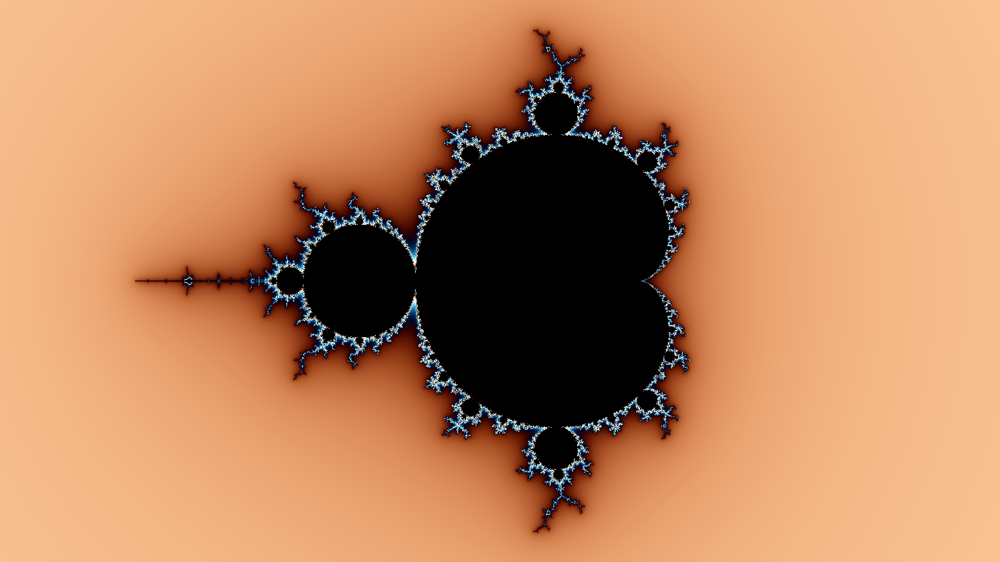
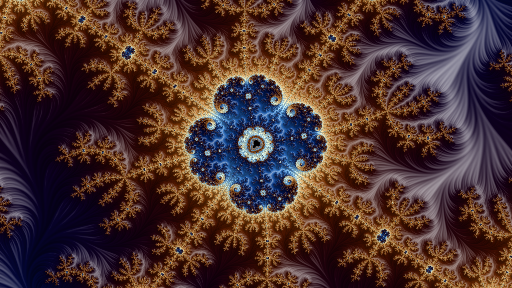
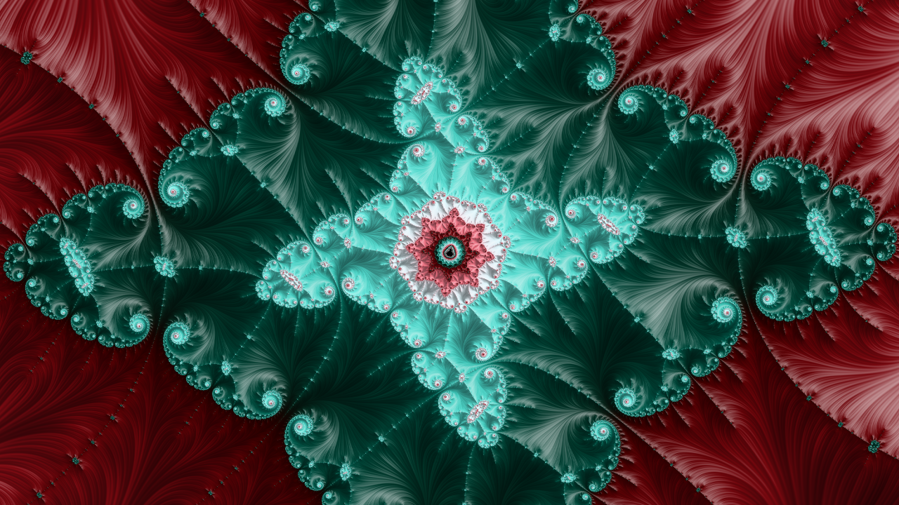
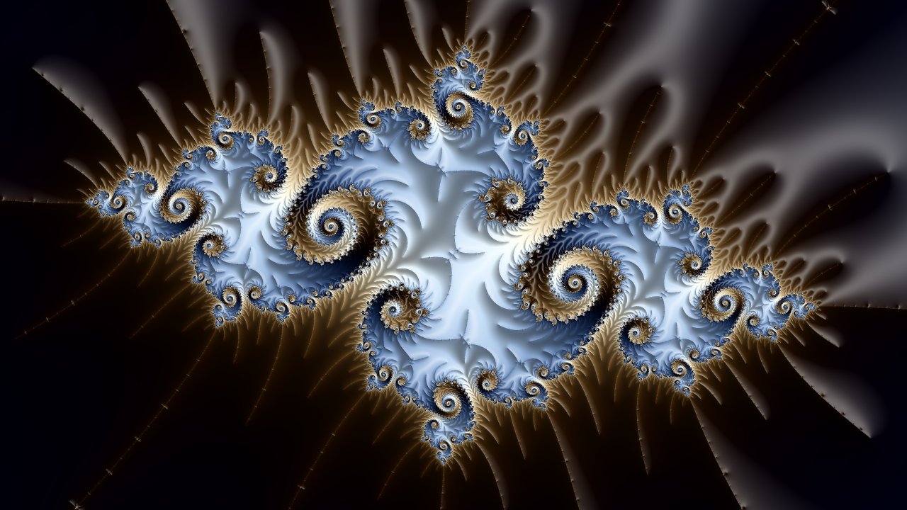
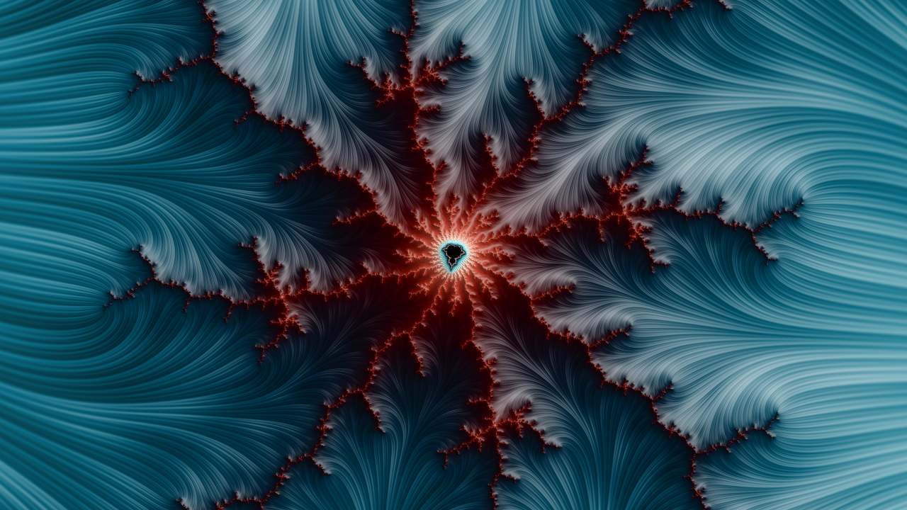
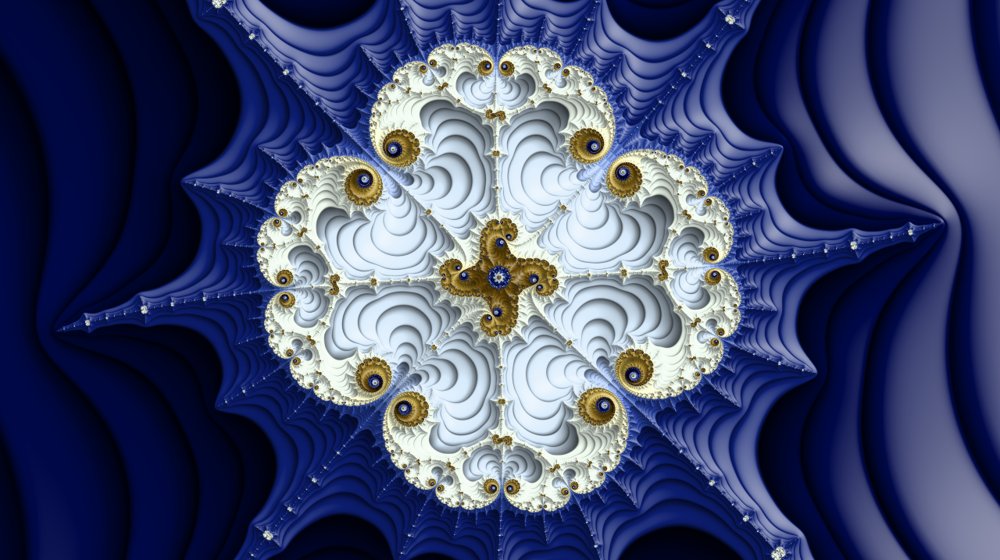
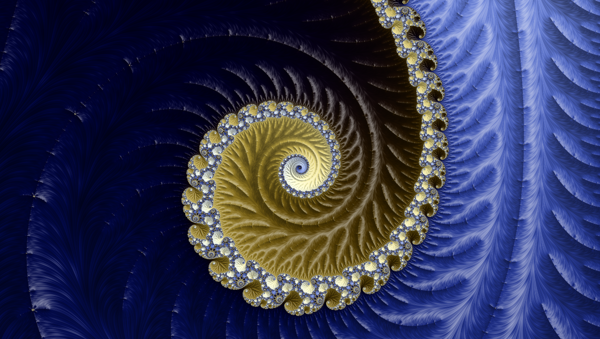
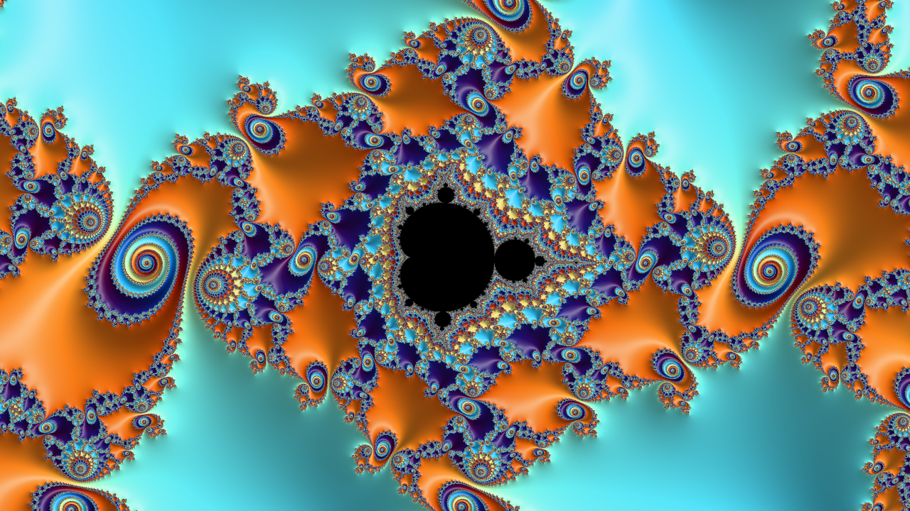
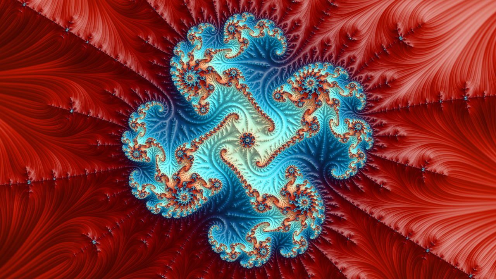

# Fast Mandelbrot set explorer

## Features
- **Accelerated on GPU** and CPU using numba CUDA JIT
- **Interactive exploration** using Matplotlib
  - Use mousewheel or left/right click to zoom in/out
  - Use sliders to change the rendering parameters
- Save still and animated images (GIF)
- Smooth iteration coloring, anti-aliasing by oversampling
- **Shading:** Blinn-Phong & Lambert lighting, stripe average coloring,
 steps shading
- Customizable color palette
- **Precision:** zoom down to float64 precision (approx. 16 significants digits)
- 100% Python 🐍

## Quick start

```python
from mandelbrot import Mandelbrot
mand = Mandelbrot() # set `gpu = False` if no GPU is available
```

### Explore the set

```python
# Explore the set using interactive Matplotlib GUI
mand.explore()
```
### Draw an image

```python
# Draw an image and save it to file
mand.draw('mandelbrot.png')
```


### Make a zoom animation

```python
# We decrease the image size to avoid overloading git and the readme page
# We also increase the number of iterations, and add stripe coloring
mand = Mandelbrot(maxiter = 5000, xpixels = 426, stripe_s = 5)
# Point to zoom at
x_real = -1.749705768080503
x_imag = -6.13369029080495e-05
mand.animate(x_real, x_imag, 'mandelbrot.gif')
```


### Run from command line

Use the following command from terminal to launch a GUI with default parameters:

```shell
python ./mandelbrot.py
```
## Gallery

Some examples of HD images, and corresponding code:

```python
mand = Mandelbrot(maxiter = 5000, rgb_thetas = [.11, .02, .92], stripe_s = 2,
                  coord = [-0.5503295086752807,
                           -0.5503293049351449,
                           -0.6259346555912755,
                           -0.625934541001796])
mand.draw('crown.png')
```


```python
mand = Mandelbrot(maxiter = 5000, rgb_thetas = [.29, .02, 0.9], ncycle = 8,
                  step_s = 10,
                  coord = [-1.9854527029227764,
                           -1.9854527027615938,
                           0.00019009159314173224,
                           0.00019009168379912058])
mand.draw('pow.png')
```


```python
mand = Mandelbrot(maxiter = 5000, rgb_thetas = [.83, .01, .99], stripe_s = 5,
                  coord = [-1.749289287806423,
                           -1.7492892878054118,
                           -1.8709586016347623e-06,
                           -1.8709580332005737e-06])
mand.draw('octogone.png')
```


```python
mand = Mandelbrot(maxiter = 5000, rgb_thetas = [.87, .83, .77],
                  coord = [-1.9415524417847085,
                           -1.9415524394561112,
                           0.00013385928801614168,
                           0.00013386059768851223])
mand.draw('julia.png')
```


```python
mand = Mandelbrot(maxiter = 5000, rgb_thetas = [.54, .38, .35], stripe_s = 8,
                  coord = [-0.19569582393630502,
                           -0.19569331188751315,
                           1.1000276413181806,
                           1.10002905416902])
mand.draw('lightning.png')
```


```python
mand = Mandelbrot(maxiter = 5000, rgb_thetas = [.47, .51, .63], step_s = 20,
                  coord = [-1.7497082019887222,
                           -1.749708201971718,
                           -1.3693697170765535e-07,
                           -1.369274301311596e-07])
mand.draw('web.png')
```


```python
mand = Mandelbrot(maxiter = 5000, rgb_thetas = [.6, .57, .45], stripe_s = 12,
                  coord = [-1.8605721473418524,
                           -1.860572147340747,
                           -3.1800170324714687e-06,
                           -3.180016406837821e-06])
mand.draw('wave.png')
```


```python
mand = Mandelbrot(maxiter = 5000, rgb_thetas = [.63, .83, .98],
                  coord = [-0.7545217835886875,
                           -0.7544770820676441,
                           0.05716740181493137,
                           0.05719254327783547])
mand.draw('tiles.png')
```


```python
mand = Mandelbrot(maxiter = 5000, rgb_thetas = [.29, .52, .59], stripe_s = 5,
                  coord = [-1.6241199193994318,
                           -1.624119919281773,
                           -0.00013088931048083944,
                           -0.0001308892443058033])
mand.draw('velvet.png')
```


## Runtime 🚀

Computing a sequence of `100` frames of HD pictures (`1280*720` pixels), with `2000` iterations takes approximately **1 second** on a Tesla K80 GPU.

## Requirements
- NumPy
- Matplotlib
- Numba
- (optional, for much faster rendering) A CUDA compatible GPU & CUDA Toolkit
