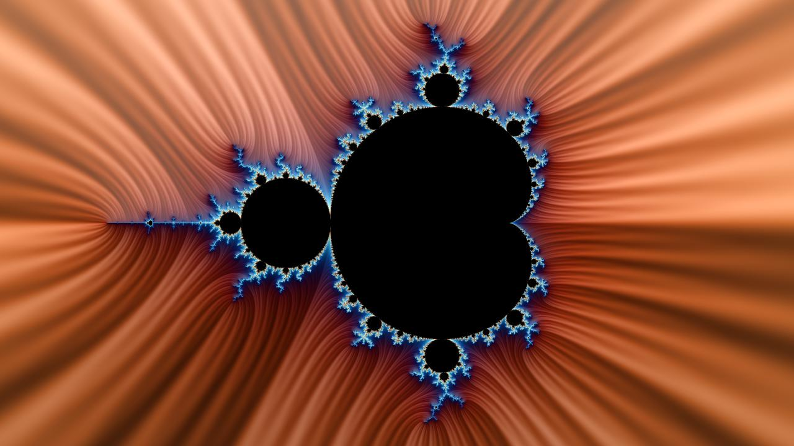
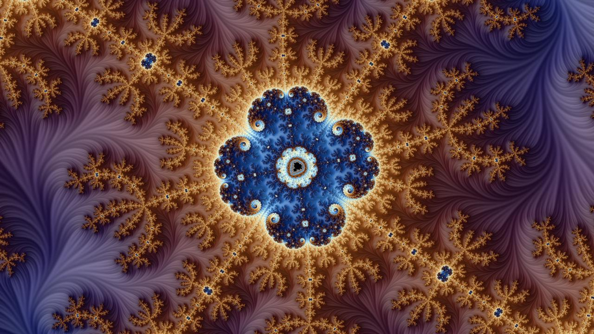
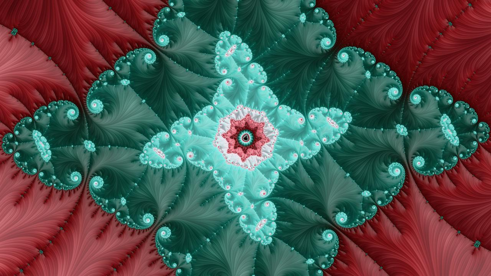
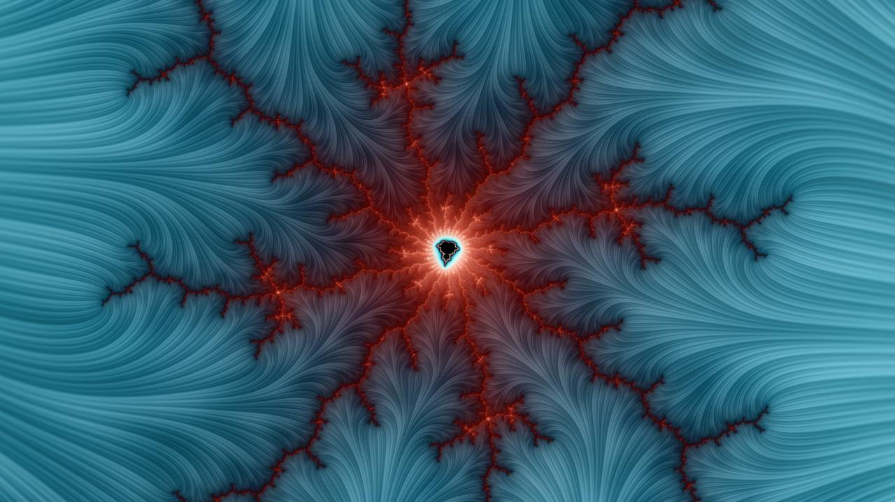
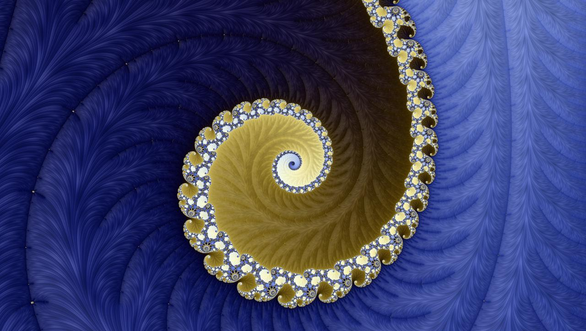
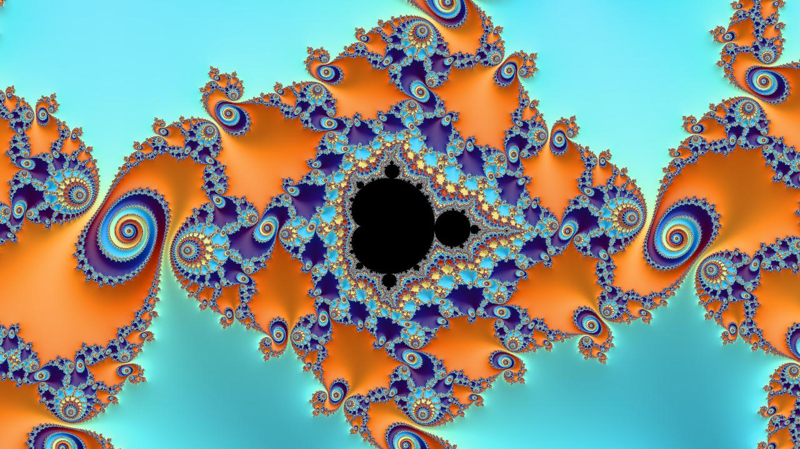

# Fast Mandelbrot set explorer

## Features
- **Accelerated on GPU** and CPU using numba CUDA JIT
- **Interactive exploration** using Matplotlib
  - Use mousewheel or left/right click to zoom in/out
  - Use button and slider to change the color palette and the number of iterations
- Save still and animated images
- Smooth iteration coloring, anti-aliasing by oversampling
- **Shading:** stripe average and Lambert normal
- Customizable color palette
- **Precision:** zoom down to float64 precision (approx. 16 significants digits)

All that in a 100% Python code 🐍

## Quick start

```python
from mandelbrot import Mandelbrot
mand = Mandelbrot() # set `gpu = False` if no GPU is available
```

### Explore the set

```python
# Explore the set using interactive Matplotlib GUI
mand.explore()
```
### Draw an image

```python
# Draw an image and save it to file
mand.draw('mandelbrot.jpg')
```


### Make a zoom animation

```python
# We decrease the image size to avoid overloading git and the readme page
mand = Mandelbrot(maxiter = 2500, xpixels = 426, gpu = True)
# Point to zoom at
x_real = -1.7492404293151038
x_imag = -0.0002615793835705974
mand.animate(x_real, x_imag, 'mandelbrot.gif')
```


### Run from command line

Use the following command from terminal to launch a GUI with default parameters:

```shell
python ./mandelbrot.py
```
## Gallery

Some examples of HD images, and corresponding code:

```python
mand = Mandelbrot(maxiter = 5000, rgb_thetas = [.11, .02, .92], stripe_s = 2,
                  light = [math.pi, 1., .25],
                  coord = [-0.5503295086752807,
                           -0.5503293049351449,
                           -0.6259346555912755,
                           -0.625934541001796])
mand.draw('crown.jpg')
```


```python
mand = Mandelbrot(maxiter = 5000, rgb_thetas = [.83, .01, .99], stripe_s = 5,
                  light = [-3*math.pi/4, 1., .25],
                  coord = [-1.749289287806423,
                           -1.7492892878054118,
                           -1.8709586016347623e-06,
                           -1.8709580332005737e-06])
mand.draw('octogone.jpg')
```


```python
mand = Mandelbrot(maxiter = 5000, rgb_thetas = [.87, .83, .77], stripe_s = 0,
                  light = [-math.pi/2, 1., .15],
                  coord = [-1.9415524417847085,
                           -1.9415524394561112,
                           0.00013385928801614168,
                           0.00013386059768851223])
mand.draw('julia.jpg')
```


```python
mand = Mandelbrot(maxiter = 5000, rgb_thetas = [.54, .38, .35], stripe_s = 8,
                  light = [-math.pi/4, 1., .1],
                  coord = [-0.19569582393630502,
                           -0.19569331188751315,
                           1.1000276413181806,
                           1.10002905416902])
mand.draw('lightning.jpg')
```


```python
mand = Mandelbrot(maxiter = 5000, rgb_thetas = [.60, .57, .45], stripe_s = 12,
                  light = [0, 1., .1],
                  coord = [-1.8605721473418524,
                           -1.860572147340747,
                           -3.1800170324714687e-06,
                           -3.180016406837821e-06])
mand.draw('wave.jpg')
```


```python
mand = Mandelbrot(maxiter = 5000, rgb_thetas = [.63, .83, .98], stripe_s = 0,
                  light = [math.pi/2, 1., .25],
                  coord = [-0.7545217835886875,
                           -0.7544770820676441,
                           0.05716740181493137,
                           0.05719254327783547])
mand.draw('tiles.jpg')
```



## Runtime 🚀

Computing a sequence of `100` frames of HD pictures (`1280*720` pixels), with `2000` iterations takes approximately **1 second** on a Tesla K80 GPU.

## Requirements
- NumPy
- Matplotlib
- Numba
- (optional, for much faster rendering) A CUDA compatible GPU & CUDA Toolkit
